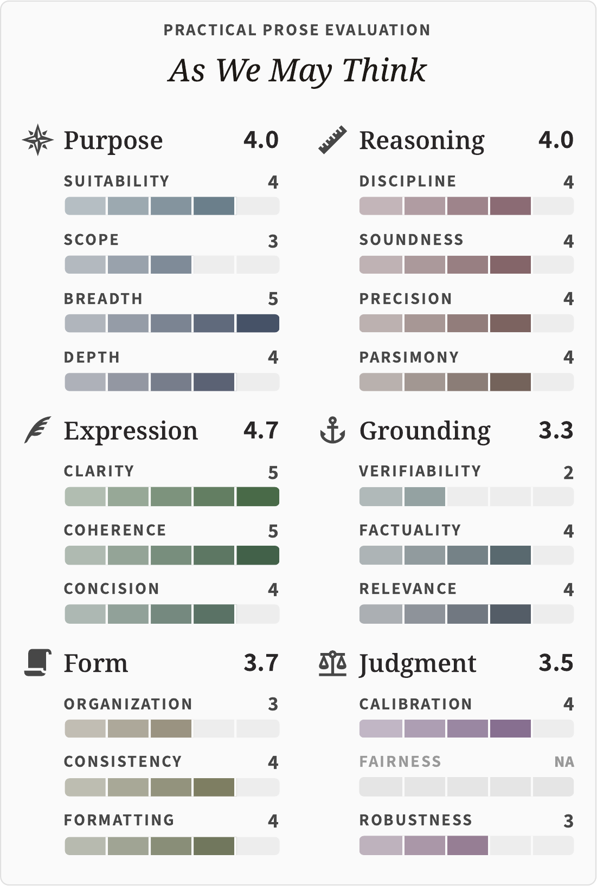
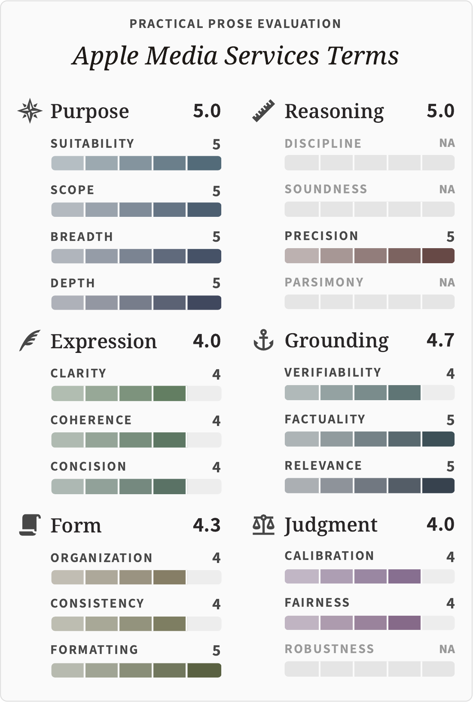

# Practical Prose

## What Is This Project?

### Clear Writing Aids Clear Thinking

Clear writing and clear thinking are inseparable.
A document is an instrument by which thought becomes visible, testable, and useful.

This project assembles principles, guidelines, and tools to improve the quality of
practical writing by humans and by agents.

The benefits are more than polished language.
The goal is to improve thinking as expressed in language and to encourage prose where
the form, content, and expression fit both human needs and the work to be done.

### Clear Writing in the Age of Slop

In many professional and technical domains, documents are increasingly written in two
main ways:

- humans writing with agent review or assistance
- agents writing with human oversight

Sadly, agents often don’t write well.
And humans don’t pay enough attention to notice.

But this is not hopeless.
The disciplines that have long improved human writing—good judgment, plus care to avoid
common errors—improve agent writing too.

### Scope

The focus here is **practical prose**: writing that helps a reader—human or
agent—understand, decide, do, or verify something.
Practical prose includes technical documents, research reports, specifications, memos,
plans, and other artifacts where value depends on usefulness.

Three key points:

- Many elements here do not apply to creative writing, personal essays, fiction, or
  other writing where the primary goals are expressive or creative.

- We focus only on English.
  In the future, this could be extended to other languages.
  With the help of sensitive native speakers and increasingly powerful AI translations,
  it’s likely we could adapt these guidelines to other languages effectively while
  preserving the nuances specific to each language.

- The focus on utility does not mean rejecting the needs of human readers.
  Good prose serves human needs and reflects human qualities.
  Usefulness is not in opposition to style, beauty, or human expression.
  The best practical writing often joins the classic virtues of structure, precision,
  and evidence with the romantic virtues of voice, rhythm, and feeling.

### Quick Start

Run the Practical Prose CLI in any repo with [uv](https://docs.astral.sh/uv/)—no install
step required:

```bash
uvx pprose --help        # explore the commands
uvx pprose install       # add the Agent Skills to the current repo
```

The PyPI package and the command are both `pprose`. `pprose install` writes one
`SKILL.md` per workflow into both `.agents/skills/` (Codex, Gemini CLI, and pi read
these natively) and `.claude/skills/` (Claude Code mirror), and maintains a
marker-bounded `pprose` block in `AGENTS.md` (preserving any other content).
Re-running it is idempotent.
See [Agent Skills](#agent-skills) for the skill catalog and [Tooling](#tooling) for the
CLI reference and install flags.

### What Is Here?

These tools help you use agents more effectively when writing, give agents context that
improves fully agent-written text, provide a framework to find weaknesses in human or
agent writing, and visualize quality to sharpen your own awareness.
Concretely:

1. Guiding [**principles**](#principles-of-quality-in-practical-writing) and
   [**guidelines**](docs/practical-prose-guidelines.md) for quality in practical writing
   for use by agents and humans
2. Measures of writing quality that include
   [**six areas**](#qualitative-measures-of-writing) (purpose, expression, form,
   reasoning, grounding, and judgment) divided into **20 dimensions**
3. An [**evaluation rubric**](docs/practical-prose-rubric.md) on how to evaluate text
   according to these dimensions
4. An automated [**visualization tool**](tools/pprose/) that uses an LLM to evaluate the
   quality of any text across these dimensions and visualize it
5. [**Agent skills**](#agent-skills) and a [**CLI**](#tooling) to package all of these
   documents and evaluation tools
6. A [**bibliography**](docs/practical-prose-bibliography.md) of notable works on
   practical writing

### Example Evaluations

The visualization tool evaluates any document across all 20 dimensions and renders the
result as a card:

<p align="center">

&nbsp;&nbsp;

</p>

*Left: Vannevar Bush, “As We May Think” (The Atlantic, 1945)—lucid prose but lightly
sourced and single-lens.
Right: the Apple Media Services Terms—broad in scope and cleanly organized, yet with
several Reasoning and Judgment dimensions N/A: a contract states terms rather than
arguing or weighing them.
Both were graded by Claude Opus 4.8; scores depend on the model and vary slightly
between runs. Source texts are in [example-texts/](example-texts/); see
[the dev note](docs/project/eval-screenshots.runbook.md) for how these are generated.*

### Is It Mature?

No. It is a new project; v0.1.0 shipped in June 2026. I’ve only been using it on my own
projects since spring 2026. It likely has a lot of ways it could improve.
But it does draw on years of reading and editing both human-written and now
agent-written text.

* * *

> [!NOTE]
> **A Personal Note**
> 
> I always admired good writing, both fiction and nonfiction.
> I have also written [open source](https://github.com/jlevy) technical and business
> guides with millions of readers and (as I was building
> [Holloway](https://www.holloway.com)) spent years developing editorial processes and
> the production of print and digital books.
> 
> A remarkable thing about the rise of LLMs is how deeply code and human language have
> become connected. I now use agents to write about equal volumes of code and documents,
> in a quantity I could never have imagined a few years ago.
> I’ve found that much of what I’ve learned about improving agent code quality applies
> to language too.
> 
> Agents are a constant source of both delight and disappointment.
> In some situations they are shockingly capable.
> Yet they write and think in sloppy ways and can make disastrous errors.
> LLMs tend toward mediocrity because they tend to write “in distribution” of the
> training data.
> 
> But just as with human writers, many agent shortcomings are correctable errors or bad
> habits. Good work arises not from statistical probabilities but from the creative
> application of *principles* of quality embraced by the best thinkers and writers.
> 
> I realize trying to codify rules for good writing is difficult to impossible.
> But I prefer to think of this as improving our ability to learn the skills of the best
> thinkers and writers.
> So I’ve tried to draw from the best sources I know about clear thinking and writing,
> including classics on style, the plain-language writing tradition, science and
> engineering writing, and journalistic practices.
> 
> In my view, the higher purpose of AI is not replacing human effort or eliminating
> work. As Doug Engelbart
> [explained](https://www.dougengelbart.org/pubs/augment-3906.html) over 60 years ago,
> it is in augmenting our own capabilities for understanding the world and solving
> shared challenges.

* * *

## Practical Writing in the Age of AI

Technical writers and editors have known for centuries that the best way to validate
written ideas is through disciplined editorial review.
Evidence can be checked, reasoning can be inspected, uncertainty can be calibrated.
By enforcing standards for quality writing, we think more clearly.

What is different now is that language is drafted, transformed, summarized, and
evaluated by LLMs in greater volume than by humans.
Much of it is slop: not just distasteful but often inaccurate or harmfully misleading.

Fluency is cheap. Judgment remains precious.

There is not enough human attention to filter and edit AI slop.
By codifying standards for quality, we can not only help humans write better but help
machines assist us in thinking and writing clearly.

Many of the challenges in working with AI involve improving the quality of thinking of
both the agents and the people who oversee the work.
You *can* outsource writing and thinking to agents.
But you can’t outsource your understanding or your judgment.

At its best, AI does not replace but rather augments human intellect.
Clear thinking is essential to solving the hardest problems.
And clear language is the way we will work with this new generation of knowledge tools.

## Principles of Quality in Practical Writing

Entire books have been written on what “quality” really is.
For our purposes, quality is fit: the parts of a document work when purpose, truth,
form, evidence, language, and reader needs support the same task.

The seven principles below decompose that fit into specific attributes.

| # | Principle | One-line definition |
| --- | --- | --- |
| 1 | **Purposeful** | The document’s content, form, order, depth, and output shape fit the reader’s needs or tasks. |
| 2 | **Truthful** | The claims are accurate based on the sources and uncertainty is accurately expressed. |
| 3 | **Essential** | The work surfaces necessary details and complexity and omits anything not relevant. |
| 4 | **Lucid** | The language and presentation help a reader orient themselves and understand the material. |
| 5 | **Verifiable** | The claims trace to verifiable sources, observations, calculations, or explicit assumptions. |
| 6 | **Maintainable** | The work is organized in a way that is maintainable for its intended shelf life and workflows. |
| 7 | **Humane** | The document respects the human reader, is understandable by humans, and serves human needs. |

## Qualitative Measures of Writing

Principles set direction, but when an editor evaluates a piece of writing, they look at
specific qualities or dimensions.

| Area | Dimension | Question |
| --- | --- | --- |
| **Purpose** | P1. Suitability | Does the document give the reader what they need, in the form the task requires? |
|  | P2. Scope | Is the scope stated, and does it fit the actual scope of the work? |
|  | P3. Breadth | Are the relevant areas within scope covered? |
|  | P4. Depth | Are the important areas developed enough? |
| **Expression** | E1. Clarity | Does the writing read well? |
|  | E2. Coherence | Do the ideas progress smoothly? |
|  | E3. Concision | Does every section earn its place? |
| **Form** | F1. Organization | Are sections, headings, sequence, tables, figures, links, and cross-references arranged for navigation? |
|  | F2. Consistency | Does the document follow the chosen style guide or house style consistently? |
|  | F3. Formatting | Is the document visually and syntactically clean in its medium? |
| **Reasoning** | R1. Discipline | Are observation, judgment, interpretation, and implication worked through in order, with each higher rung supported by the prior? |
|  | R2. Soundness | Do claims follow from evidence through valid mechanisms? |
|  | R3. Precision | Are claims and terms specified at the right granularity? |
|  | R4. Parsimony | Is each load-bearing reasoning chain the cleanest, simplest sound argument possible for its conclusion? |
| **Grounding** | G1. Verifiability | Are claims traceable to sources or calculations? |
|  | G2. Factuality | Do cited sources support the claims as asserted? |
|  | G3. Relevance | Do sources, citations, and reasoning chains bear on the document’s stated purpose? |
| **Judgment** | J1. Calibration | Does claim strength match evidence strength? |
|  | J2. Fairness | Are opposing positions argued at proportional evidentiary depth? |
|  | J3. Robustness | Do key claims survive plausible alternative interpretations? |

Each dimension maps back to one or more principles in
[practical-prose-principles.md](docs/practical-prose-principles.md); prescriptive rules
live in [practical-prose-guidelines.md](docs/practical-prose-guidelines.md) and 1-5
scoring anchors in [practical-prose-rubric.md](docs/practical-prose-rubric.md).

## Layers

The system has seven reference layers and two operational layers.
Each layer answers a different question.

| Layer | Doc | Answers |
| --- | --- | --- |
| **Common** | [common-doc-guidelines.md](docs/common-doc-guidelines.md) | What general document standards do all docs (practical or otherwise) follow? |
| **Principles** | [practical-prose-principles.md](docs/practical-prose-principles.md) | Why these rules: what seven principles do they descend from? |
| **Guidelines** | [practical-prose-guidelines.md](docs/practical-prose-guidelines.md) | What should the writer do: prescriptive rules for the 20 dimensions? |
| **Rubric** | [practical-prose-rubric.md](docs/practical-prose-rubric.md) | How is a document scored: descriptive 1-5 anchors for the same 20 dimensions? |
| **Genre: Guides** | [writing-practical-guides.md](docs/writing-practical-guides.md) | What does the comprehensive-guide genre additionally demand, and when do those extra rules apply? |
| **Bibliography** | [practical-prose-bibliography.md](docs/practical-prose-bibliography.md) | Where do these ideas come from: what works ground each tradition? |
| **Metrics** | [practical-prose-metrics.md](docs/practical-prose-metrics.md) | Which quantitative metrics and qualitative checks map to which dimensions; recommended frontmatter schema. |
| **Shortcut** | [practical-prose-quick-checklist.md](shortcuts/practical-prose-quick-checklist.md) | One-page pre-publish self-audit across the 20 dimensions. |
| **Runbook** | [runbooks/](runbooks/) | Operational steps for single-document evals and N-way comparisons. |

The Common layer is the base substrate.
`common-doc-guidelines.md` captures general organization, structure, style, and
formatting rules that apply to *any* document—technical docs, READMEs, internal memos,
specifications—not just practical prose.
The practical-prose layers (Principles, Guidelines, Rubric) build on top of it with the
seven principles and 20 dimensions specific to evaluating practical writing.
Principles, Guidelines, and Rubric form a tight triple: same seven principles, same 20
dimensions, same six groups (Purpose, Expression, Form, Reasoning, Grounding, Judgment).
Genre supplements extend those core layers only where a genre demands more; the first
one covers [comprehensive practical guides](docs/writing-practical-guides.md), not all
practical documents.
The bibliography supplies the intellectual basis; the shortcuts and runbooks are how the
system gets used in practice.

## Where to Start

- **Writing a document and want the rules:**
  [practical-prose-guidelines.md](docs/practical-prose-guidelines.md).
- **Writing a comprehensive practical guide:**
  [writing-practical-guides.md](docs/writing-practical-guides.md), including its
  groundwork process for scoping the guide before outlining.
- **Scoring a document and want the anchors:**
  [practical-prose-rubric.md](docs/practical-prose-rubric.md).
- **Running a pre-publish self-audit:**
  [practical-prose-quick-checklist.md](shortcuts/practical-prose-quick-checklist.md).
- **Running a formal eval:** the [runbooks/](runbooks/) directory.
- **Understanding why a rule exists:** the corresponding principle in
  [practical-prose-principles.md](docs/practical-prose-principles.md), and the source
  tradition in [practical-prose-bibliography.md](docs/practical-prose-bibliography.md).
- **Looking at the tooling:** [tools/pprose/](tools/pprose/) is the installable Python
  package with the metrics, scoring, and report generators.

## Agent Skills

This repo can be used directly by modern coding agents through `AGENTS.md` and portable
Agent Skills under [skills/](skills/). The eval skills use the
[`pprose` tooling](#tooling) described below.

| Skill | Kind | Use When |
| --- | --- | --- |
| [pprose-common-edit](skills/pprose-common-edit/SKILL.md) | Apply | Tidy, clean up, conform, fix formatting/structure, or add the documentation footer. The basic, universal tier. |
| [pprose-copy-edit](skills/pprose-copy-edit/SKILL.md) | Apply | Copy edit, proofread, polish, tighten, or line edit: language and formatting (Expression). Superset of common-edit. |
| [pprose-full-edit](skills/pprose-full-edit/SKILL.md) | Apply | Deep edit across all 20 dimensions; also writes an editorial review (strengths, weaknesses, suggested fixes). Superset of copy-edit; covers audit-only review. |
| [pprose-review](skills/pprose-review/SKILL.md) | Review | Review, critique, or get a tiered edit plan (what a common edit, copy edit, and full substantive pass would each change) without modifying the document and without scores. Read-only. |
| [pprose-eval](skills/pprose-eval/SKILL.md) | Evaluate | Score, grade, rubric-check, or measure the quality of one document. |
| [pprose-compare](skills/pprose-compare/SKILL.md) | Evaluate | Compare drafts, A/B versions, quality-diff documents, or pick a best variant. |

Install paths:

1. **Recommended:** let `pprose install` set up every supported surface in any repo (see
   [Quick Start](#quick-start) for what it writes and the scope flags).
2. Point the agent at *this* repo and let `AGENTS.md` route to the right skill: the
   committed `skills/<name>/SKILL.md` files are version-pinned discovery copies that
   work as a `npx skills add` / skills.sh landing page.
3. If a Claude Code plugin marketplace entry exists, install that as a Claude-only
   convenience.

The skills are intentionally small routers: each names the workflow once and points at
`pprose <command>` / `pprose guidelines <name>` / `pprose shortcut <name>` rather than
duplicating that content.
The `pprose` CLI bundles the guidelines, shortcuts, runbooks, and rubric inside its
wheel, so an installed skill works in any repo with no other files present.

## Tooling

[tools/pprose/](tools/pprose/) is a standalone modern-Python package (bootstrapped from
[`simple-modern-uv`](https://github.com/jlevy/simple-modern-uv)). The distribution and
console-script entry point are both `pprose`:

- `pprose metrics`: deterministic metrics over a document (banned-register hits,
  vague-word counts, link validity, frontmatter presence, etc.).
- `pprose score`: score a document against the rubric via Pydantic AI (Anthropic,
  OpenAI, or Google; `--model` required); Anthropic runs reuse a cached
  rubric+guidelines block, and `--batch` runs N artifacts in parallel.
- `pprose report`: combine metrics and scores into an eval report; validate,
  compute-derived, and from-metrics subcommands.
- `pprose compare`: compare N eval reports across versions or variants.

It also bundles the guidelines, shortcuts, runbooks, and rubric and serves them as
reference subcommands (`pprose guidelines|shortcut|runbook|skill <name>`, `--list` to
enumerate), so the skills work in any repo.
Every artifact `pprose install` generates carries a `format=fNN surface=…` stamp, so
re-running install is idempotent and a newer-format artifact is never clobbered by an
older pprose. Each generated skill references pprose with a pinned, local-first
invocation (`pprose` if on PATH, else `uvx pprose@<version>`—the trusted version that
ran install—else a message telling the user to install uv or pprose).
Scope installs with `--project` (the default inside a git repo) or `--global`, and
select destinations with `--surfaces=portable,claude,agents-md`. New releases can add
guidelines and skills; because installed skills pin the version that installed them, a
repo picks up additions only when you upgrade and re-run install
(`uvx pprose@latest install`, or `uv tool install --upgrade pprose && pprose install`).
Re-running refreshes the artifacts and the version pin they bake.

Example eval pass (no install via [uv](https://docs.astral.sh/uv/); `score` needs
`--model` plus a provider API key):

```bash
uvx pprose report from-metrics path/to/doc.md --label my-doc --scope-class brief --out my-doc.eval.md
uvx pprose score my-doc.eval.md --model opus
uvx pprose report validate my-doc.eval.md
```

## License

Code is MIT licensed.
Content (principles, guidelines, rubric, and other prose) is
[CC BY 4.0](https://creativecommons.org/licenses/by/4.0/). See [LICENSE](LICENSE) for
details.

<!-- This document follows common-doc-guidelines.md.
See github.com/jlevy/practical-prose and review guidelines before editing.
-->
